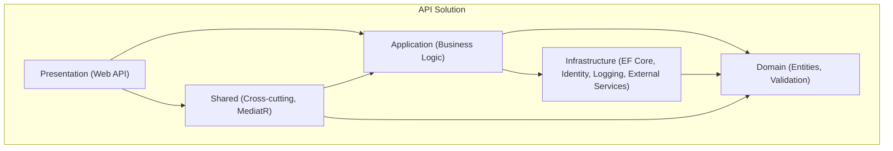

# CourtBooker-Auth

**Description:**
CourtBooker-Auth is a modern, automated .NET 9 API solution for authentication and user management, built with clean architecture principles, containerization, and robust DevOps tooling. It is designed for scalable, secure, and maintainable backend development, supporting local development, automated builds, testing, and Docker-based deployment.

---

## 🏗️ Big Picture

This repository powers the authentication backend for CourtBooker, using .NET 9 and a layered architecture. It supports local development, automated builds, testing, and Docker-based deployment. All workflows are automated via PowerShell scripts and Psake.

### **Mermaid: High-Level Architecture**



---

## 📁 Root Folder Overview

- **Build/**  
	PowerShell scripts for setup, build, test, Docker image creation, and deployment.  
	*Key scripts:*  
	- `setup.ps1`: Prepares local dev environment  
	- `build-solution.ps1`: Restores/builds .NET solution  
	- `run-tests.ps1`: Runs all tests  
	- `build-image.ps1`: Builds Docker image  
	- `publish-image.ps1`: Publishes image to registry  
	- `start-container.ps1`: Runs container locally

- **Dependencies/**  
	NuGet packages and toolkit dependencies, including Psake and custom automation tools.

- **Env/**  
	Environment variable scripts for local development (`development.env.ps1`).  
	*Never commit secrets!*

- **Output/**  
	Compiled binaries, configuration files, and published assets.

- **src/**  
	Main source code, organized by clean architecture layers:
	- `Application/`: Business logic, use cases, service interfaces
	- `Domain/`: Core entities, validation, domain rules
	- `Infrastructure/`: Data access (EF Core, PostgreSQL), Identity, logging, external integrations
	- `Presentation/`: ASP.NET Core Web API, controllers, DI setup
	- `Shared/`: Cross-cutting concerns, MediatR, utilities
	- `CourtBooker-Auth.sln`: Solution file

- **Tests/**  
	Unit and integration tests for all layers, using xUnit and Moq.

---

## �️ Technologies Used

- **.NET 9**: Modern C# features, ASP.NET Core Web API
- **Entity Framework Core**: Data access, migrations, PostgreSQL
- **Microsoft Identity**: Authentication, JWT, user management
- **Serilog & Elastic Logging**: Structured logging, integration with Elastic stack
- **Azure Key Vault**: Secure secrets management
- **FluentValidation**: Domain and DTO validation
- **MediatR**: CQRS, decoupled request/response
- **Docker**: Containerization, multi-stage builds
- **PowerShell & Psake**: DevOps automation, build/test/deploy scripts
- **xUnit, Moq**: Testing framework and mocking

---

## 🧩 Design Patterns

- **Clean Architecture**: Separation of concerns, dependency inversion, testability
- **CQRS (via MediatR)**: Command/Query separation for business logic
- **Dependency Injection**: ASP.NET Core DI for all layers
- **Repository Pattern**: Data access abstraction in Infrastructure
- **Unit of Work**: Transaction management for EF Core
- **Configuration via Environment**: Secure, flexible config for dev/prod

---

## 🚀 Getting Started

1. **Install prerequisites**:  
	 - Chocolatey, NuGet CLI, PowerShell Core, .NET SDK 9, GGSHIELD

2. **Setup local environment**:  
	 ```powershell
	 ./Build/setup.ps1
	 ```

3. **Build and test**:  
	 ```powershell
	 ./Build/build-solution.ps1
	 ./Build/run-tests.ps1
	 ```

4. **Run locally (Docker)**:  
	 ```powershell
	 ./Build/build-image.ps1
	 ./Build/start-container.ps1
	 ```

5. **Publish image**:  
	 ```powershell
	 ./Build/publish-image.ps1
	 ```

---

## � Notes

- All environment secrets must be set via local `.env` or `Env/development.env.ps1` (never commit secrets).
- Scripts automate repetitive DevOps tasks and can be integrated into CI/CD pipelines.
- For more details, see comments in each script and project file.